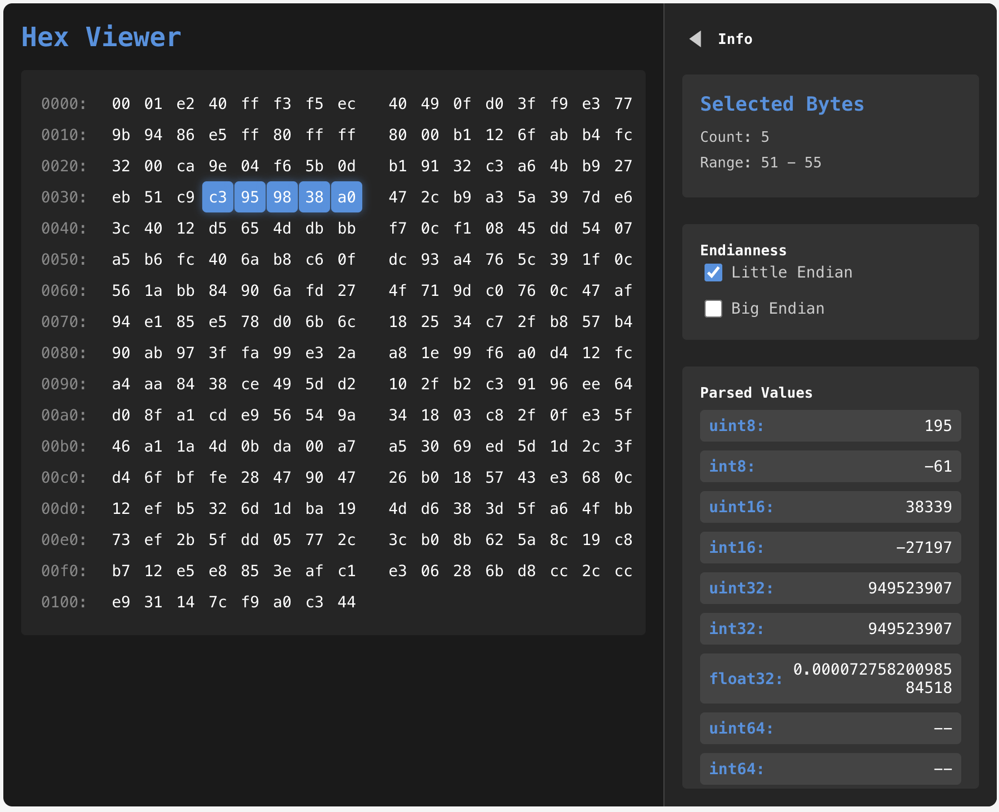

# hex-viewer

一个功能强大的React十六进制查看器组件，支持数据解析、字节选择和响应式设计。



## 功能特性

- 📊 显示十六进制和ASCII数据
- 🎯 支持单个字节和范围选择
- 🔄 支持小端和大端字节序切换
- 📐 可折叠侧边栏，显示解析后的数据
- 📱 响应式设计，适配不同屏幕尺寸
- 🎨 现代化UI设计，支持主题定制

## 安装

使用npm安装：

```bash
npm install @zaynxu/hex-viewer
```

使用yarn安装：

```bash
yarn add @zaynxu/hex-viewer
```

## 基本使用

```jsx
import React from 'react';
import HexViewer from '@zaynxu/hex-viewer';

function App() {
  // 创建测试数据
  const buffer = new ArrayBuffer(264);
  const view = new DataView(buffer);
  
  // 添加一些测试数据
  view.setInt32(0, 123456);
  view.setInt32(4, -789012);
  view.setFloat32(8, 3.14159);
  view.setFloat64(12, 1.6180339887);
  
  return (
    <div className="App">
      <h1>Hex Viewer Demo</h1>
      <HexViewer data={buffer} />
    </div>
  );
}

export default App;
```

## API参考

### HexViewer 组件

#### Props

| 属性 | 类型 | 描述 |
|------|------|------|
| `data` | `ArrayBuffer` | 要显示的二进制数据 |

#### 功能

- 点击字节可选择单个字节
- 按住鼠标并拖动可选择多个字节
- 侧边栏显示选中字节的解析值
- 支持切换字节序（小端/大端）
- 可折叠侧边栏以节省空间

## 数据解析

组件支持解析以下数据类型：

- 无符号整数：uint8, uint16, uint32, uint64
- 有符号整数：int8, int16, int32, int64
- 浮点数：float32, float64

## 自定义样式

组件使用CSS模块化，可以通过覆盖以下CSS变量来自定义样式：

```css
:root {
  --hex-background-color: #f5f5f5;
  --hex-text-color: #333;
  --hex-selected-color: #4a90e2;
  --hex-sidebar-background: #e9e9e9;
}
```

## 开发

### 克隆仓库

```bash
git clone https://github.com/zhengzhou/hexviewer.git
cd hexviewer
```

### 安装依赖

```bash
npm install
```

### 启动开发服务器

```bash
npm run dev
```

### 构建项目

```bash
npm run build
```

### 运行测试

```bash
npm run test
```

## 贡献

欢迎提交Issue和Pull Request！

## 许可证

MIT License
